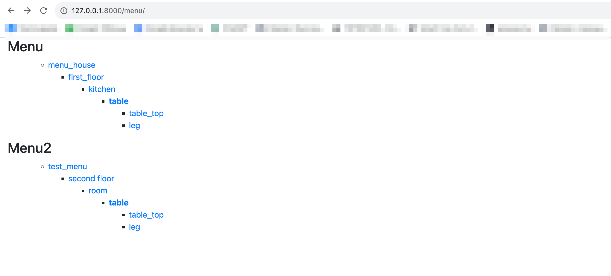

# DjangoProject

## Часть 1: Запуск

Скачайте проект.

В файле `.env` заполните все не закоменченные переменные окружения.

Для работы приложения необходимо предварительно установить [Docker Engine](https://docs.docker.com/engine/install/) 
и [Docker Compose](https://docs.docker.com/compose/install/).

После чего находясь в каталоге с файлом docker-compose.dev.yml выполните команду:

```js
 docker compose -f docker-compose.dev.yml up -d
```
Открыть в браузере страницу с демонстрацией функционала по адресу:
```js
 http://127.0.0.1:8000/menu/
```
## Часть 2: Задачи

Реализация древовидного меню.

Все, что над выделенным пунктом - развернуто. Первый уровень вложенности под выделенным пунктом тоже развернут.

Хранится в БД.

Редактирование через админку Django.

Активный пункт меню определяется исходя из URL текущей страницы

Меню на одной странице может быть несколько. Они определяются по названию.

При клике на меню происходит переход по заданному в нем URL. URL может быть задан как явным образом, так и через named url.

На отрисовку каждого меню требуется ровно 1 запрос к БД

## Часть 3: Реализация

Задача реализована только через Django и стандартные библиотеки Python.

Приложение представляет из себя проект Django + использовалась БД SQLite.

Отрисовка меню реализовано через template tag `draw_menu`

Для хранения данных узлов меню используется сущность `menu_menuitem`
```js
create table menu_menuitem
(
    id        integer      not null
        primary key autoincrement,
    title     varchar(100) not null,
    url       varchar(200) not null,
    parent_id bigint
        references menu_menuitem
            deferrable initially deferred
);
```
Атомарность запроса к БД для отрисовки меню реализована в методе `get_entity_parents`, который просто использует SQL запрос в обход ORM. Текст запроса предcтавлен в [файле](https://github.com/Xei201/djangoProject/blob/main/menu/sql/get_three_menu.py)

Далее приведен пример двух реализаций меню. Выделенный элемент меню выделяется с использованием класса activ, который применяет жирное начертание шрифта.



